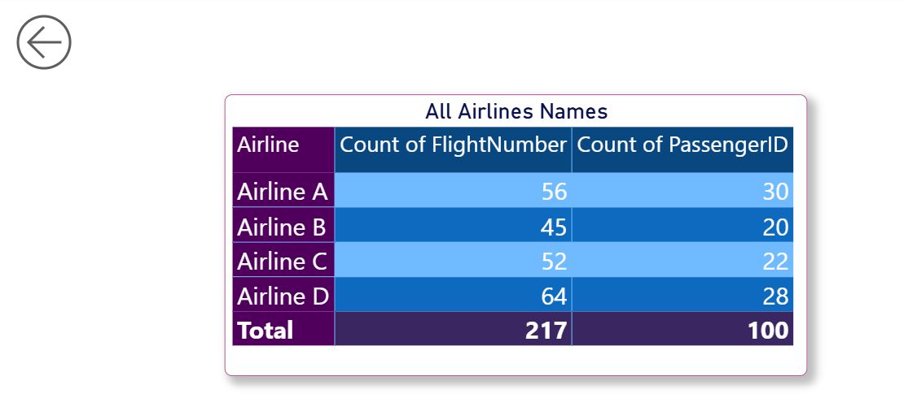
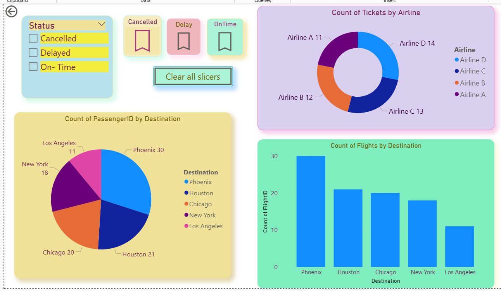
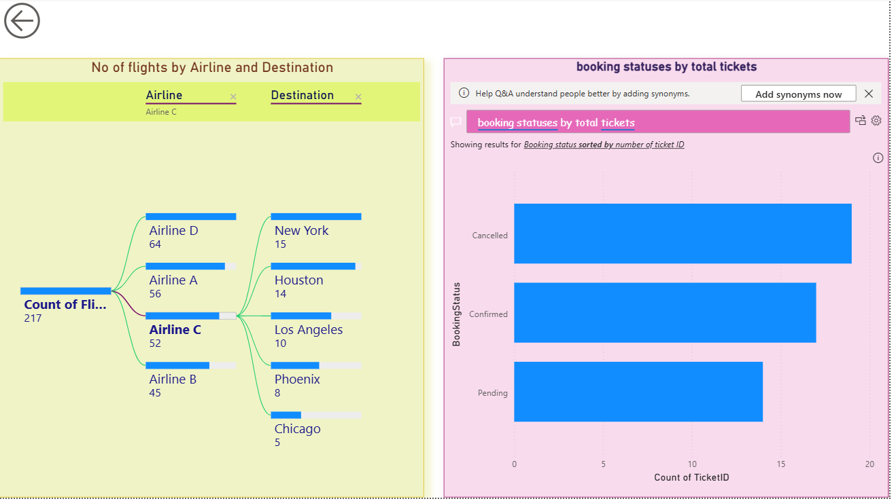
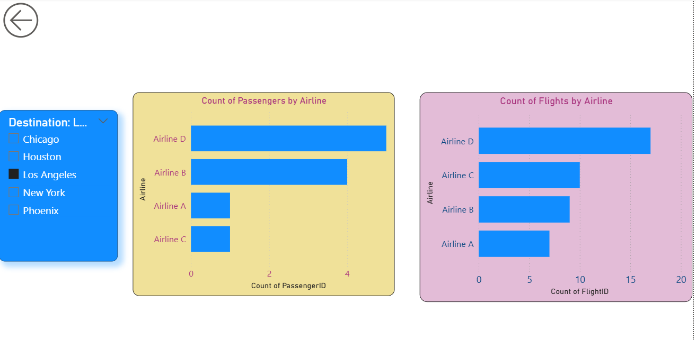
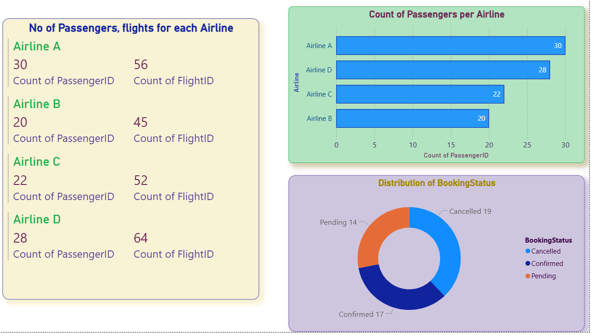

# airline-performance-analysis

# ✈️ Airline Performance Analysis – Power BI Dashboard

This project is a visual analysis of airline performance metrics using Power BI. I worked with raw flight data to explore how different airlines perform when it comes to delays, cancellations, and overall reliability. The goal was to turn raw numbers into clear insights through data cleaning, modeling, and storytelling with interactive visuals.

## 📊 What This Dashboard Covers

- Average delay times across different airlines and routes
- Flight cancellation trends and patterns
- Monthly performance trends
- On-time performance percentages
- Dynamic filters for city, airline, and date selections

## 🧹 Data Cleaning & Modeling

All data transformation was handled in Power Query inside Power BI Desktop. I took care to:
- Remove nulls and irrelevant columns
- Standardize column types and formats
- Create calculated fields and DAX measures to power KPIs
- Build a simple, clean data model with meaningful relationships

## 🛠 Tools Used

- Power BI Desktop
- Power Query for ETL
- DAX for calculated measures
- Visualizations: bar charts, slicers, cards, line graphs

## 📸 Dashboard Previews

### 🟪 Airline & Passenger Summary

### 🌍 Destination Ticket and Flight Distribution

### 🔀 Flights by Airline and Destination

### 📊 Passengers and Flights by Airline

### 📌 Airline Overview & Booking Status

## 📁 File

- `Airline_Performance_Analysis.pbix` — The full Power BI project file

## 📌 How to View

Download and open the `.pbix` file using [Power BI Desktop](https://powerbi.microsoft.com/en-us/desktop/). From there, you can interact with all the visuals and explore the insights.

---

Let me know if you'd like to collaborate or need help understanding any part of this report!
